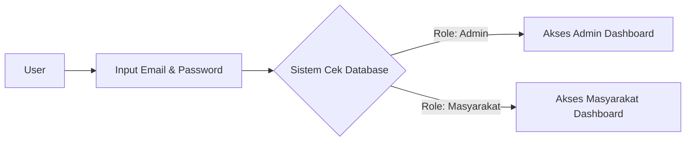
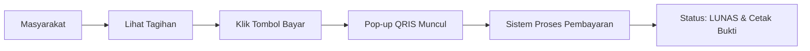
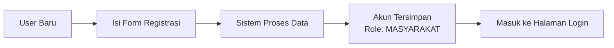
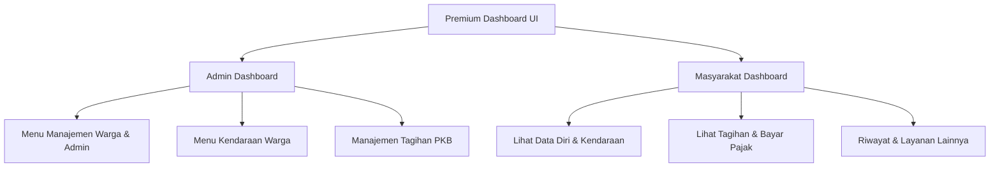

# Pelayanan Masyarakat API - SAMSAT Digital

Proyek ini adalah sistem layanan masyarakat berbasis Spring Boot dan React Vite yang menyediakan fitur autentikasi, dashboard, pengelolaan data masyarakat, data kendaraan, layanan pajak kendaraan bermotor (PKB), pembayaran pajak, pengaduan masyarakat, laporan, serta bukti pembayaran.

## Teknologi yang Digunakan

### Backend

- Java 21
- Spring Boot
- Spring Data JPA
- Spring Web
- MySQL Driver
- Lombok

### Frontend

- React Vite
- React Router DOM
- Axios
- CSS

### Database

- MySQL

## Dokumentasi Endpoint API

Berikut adalah daftar endpoint API yang tersedia pada sistem ini:

### 1. Autentikasi (`/api/auth`)

Digunakan untuk proses registrasi dan login. Role user tidak dipilih manual oleh user, tetapi ditentukan oleh sistem berdasarkan data akun di database.

| Method | Endpoint                   | Deskripsi                            | Request Body   |
| ------ | -------------------------- | ------------------------------------ | -------------- |
| `POST` | `/api/auth/login`          | Login otomatis berdasarkan role akun | `LoginRequest` |
| `POST` | `/api/auth/register/warga` | Mendaftarkan akun warga baru         | `Pengguna`     |
| `POST` | `/api/auth/register/admin` | Mendaftarkan akun admin baru         | `Admin`        |
| `POST` | `/api/auth/login/warga`    | Login warga versi lama               | `Pengguna`     |
| `POST` | `/api/auth/login/admin`    | Login admin versi lama               | `Admin`        |

### 2. Dashboard (`/api/dashboard`)

Digunakan untuk mendapatkan ringkasan data atau metrik pada dashboard.

| Method | Endpoint                 | Deskripsi                          | Response              |
| ------ | ------------------------ | ---------------------------------- | --------------------- |
| `GET`  | `/api/dashboard/summary` | Mengambil data ringkasan dashboard | `Map<String, Object>` |

### 3. Data Masyarakat (`/api/pengguna`)

Digunakan untuk mengelola data masyarakat atau wajib pajak.

| Method   | Endpoint             | Deskripsi                                |
| -------- | -------------------- | ---------------------------------------- |
| `GET`    | `/api/pengguna`      | Mengambil semua data masyarakat          |
| `GET`    | `/api/pengguna/{id}` | Mengambil data masyarakat berdasarkan ID |
| `POST`   | `/api/pengguna`      | Menambahkan data masyarakat              |
| `DELETE` | `/api/pengguna/{id}` | Menghapus data masyarakat                |

### 4. Data Kendaraan (`/api/kendaraan`)

Digunakan untuk mengelola kendaraan milik masyarakat.

| Method   | Endpoint                   | Deskripsi                                   |
| -------- | -------------------------- | ------------------------------------------- |
| `GET`    | `/api/kendaraan`           | Mengambil semua data kendaraan              |
| `GET`    | `/api/kendaraan/{id}`      | Mengambil kendaraan berdasarkan ID          |
| `GET`    | `/api/kendaraan/nik/{nik}` | Mengambil kendaraan berdasarkan NIK pemilik |
| `POST`   | `/api/kendaraan`           | Menambahkan kendaraan baru                  |
| `PUT`    | `/api/kendaraan/{id}`      | Mengubah data kendaraan                     |
| `DELETE` | `/api/kendaraan/{id}`      | Menghapus data kendaraan                    |

### 5. Layanan PKB (`/api/layanan`)

Digunakan untuk mengelola tagihan dan pembayaran Pajak Kendaraan Bermotor (PKB).

| Method | Endpoint                  | Deskripsi                                                | Request Body / Param |
| ------ | ------------------------- | -------------------------------------------------------- | -------------------- |
| `POST` | `/api/layanan`            | Membuat tagihan pajak kendaraan                          | `LayananPKB`         |
| `GET`  | `/api/layanan`            | Mengambil semua data tagihan pajak                       | -                    |
| `GET`  | `/api/layanan/{id}`       | Mengambil tagihan pajak berdasarkan ID                   | `id`                 |
| `PUT`  | `/api/layanan/{id}/bayar` | Membayar tagihan pajak dan mengubah status menjadi LUNAS | `id`                 |

### 6. Pengaduan Masyarakat (`/api/pengaduan`)

Digunakan untuk mengelola sistem pelaporan atau pengaduan dari masyarakat.

| Method | Endpoint                     | Deskripsi                                 | Request Body / Param |
| ------ | ---------------------------- | ----------------------------------------- | -------------------- |
| `POST` | `/api/pengaduan`             | Membuat pengaduan baru                    | `Pengaduan`          |
| `GET`  | `/api/pengaduan`             | Mengambil semua data pengaduan            | -                    |
| `GET`  | `/api/pengaduan/{id}`        | Mengambil detail pengaduan berdasarkan ID | `id`                 |
| `PUT`  | `/api/pengaduan/{id}/status` | Mengubah status pengaduan                 | `id`, `status`       |

## Konsep Denda Pajak

Sistem memiliki fitur jatuh tempo dan denda otomatis. Admin hanya menentukan tanggal jatuh tempo saat membuat tagihan. Denda tidak diinput manual oleh admin, tetapi dihitung otomatis oleh sistem jika pembayaran melewati jatuh tempo.

Rumus denda:

```txt
Denda = Rp50.000 x jumlah bulan keterlambatan
```

Total pembayaran:

```txt
Total Bayar = Nominal Tagihan + Denda
```

Contoh:

```txt
Telat 1 bulan = Rp50.000
Telat 2 bulan = Rp100.000
Telat 3 bulan = Rp150.000
```

Setelah pembayaran berhasil, status tagihan berubah menjadi `LUNAS`, metode pembayaran dan tanggal bayar tersimpan, serta masyarakat dapat mencetak bukti pembayaran.

## Cara Menjalankan Secara Lokal

### Backend

1. Pastikan Anda telah menginstal Java dan MySQL.
2. Konfigurasi database pada file `application.properties` sesuai kredensial MySQL lokal.
3. Jalankan aplikasi menggunakan Maven:

```bash
./mvnw spring-boot:run
```

Untuk Windows PowerShell:

```bash
.\mvnw spring-boot:run
```

4. Backend berjalan pada port default:

```txt
http://localhost:8080
```

### Frontend

1. Masuk ke folder frontend:

```bash
cd frontend
```

2. Install dependency:

```bash
npm install
```

3. Jalankan frontend:

```bash
npm run dev
```

4. Frontend berjalan pada:

```txt
http://localhost:5173
```

## Revisi dan Penambahan Fitur

Berikut perubahan yang ditambahkan pada sistem berdasarkan revisi asisten laboratorium:

### 1. Membuat Halaman Login

**Penjelasan singkat:**
- **Yang direvisi/ditambah:** Halaman login (`Login.jsx`) dan alur autentikasi.
- **Detail:** User sekarang login hanya menggunakan email dan password. Pilihan (dropdown) role pengguna pada form login telah dihapus, karena penentuan role (Admin/Masyarakat) kini ditentukan otomatis oleh sistem/backend (berdasarkan pengaturan admin), bukan dipilih sendiri oleh user.

**Alur Login:**


### 2. Menambahkan Fitur Pembayaran

**Penjelasan singkat:**
- **Yang direvisi/ditambah:** Halaman tagihan (`TagihanPage.jsx`) dan penambahan pop-up pembayaran/QRIS.
- **Detail:** Menambahkan fitur agar masyarakat dapat langsung membayar tagihan pajak kendaraannya dari dalam aplikasi. Setelah pembayaran selesai, status tagihan otomatis berubah menjadi `LUNAS` dan masyarakat bisa melihat serta mencetak bukti pembayaran.

**Alur Pembayaran:**


### 3. Membuat Halaman Registrasi

**Penjelasan singkat:**
- **Yang direvisi/ditambah:** Halaman registrasi baru (`Register.jsx`) dan route pendaftaran.
- **Detail:** Menambahkan halaman agar masyarakat bisa membuat akun mereka sendiri. Pada form registrasi ini, user tidak perlu/tidak bisa menentukan role sendiri.

**Alur Registrasi:**


### 4. Memperbaiki Tampilan dan Fungsi Dashboard

**Penjelasan singkat:**
- **Yang direvisi/ditambah:** Desain antarmuka (UI) untuk `AdminDashboard.jsx`, `MasyarakatDashboard.jsx`, serta penambahan komponen animasi (seperti `TiltCard.jsx`).
- **Detail:** Tampilan dashboard dirombak total menjadi lebih premium, interaktif, rapi, dan modern. Fungsi menu navigasi dan ringkasan data juga dioptimalkan agar berjalan dengan lancar sesuai role pengguna.

**Struktur Dashboard UI Baru:**


