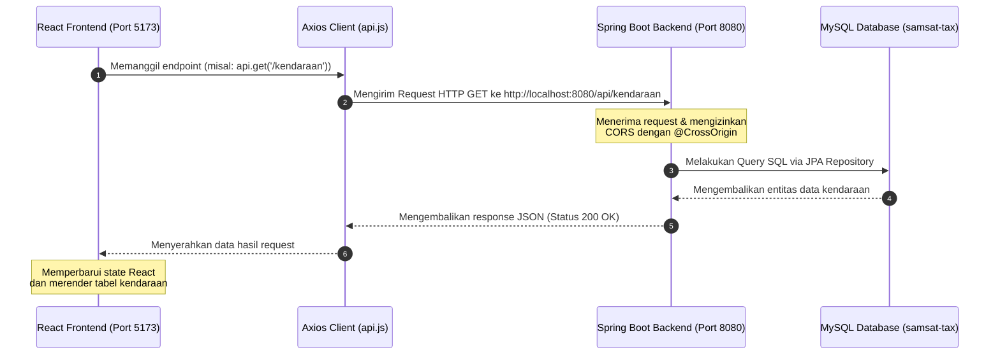

# 🌟 SAMSAT Tax Service - React Frontend

Selamat datang di repositori Frontend aplikasi **SAMSAT Tax Service**. Aplikasi ini dibangun menggunakan **React** + **Vite** untuk antarmuka pengguna (User Interface) yang cepat, responsif, dan dinamis, serta terhubung langsung ke backend **Spring Boot**.

---

## 🛠️ Tech Stack & Prerequisites

*   **Framework:** React (Vite)
*   **HTTP Client:** Axios (untuk berkoneksi dengan Backend API)
*   **Styling:** Vanilla CSS (kustom premium & responsive)
*   **Routing:** React Router DOM
*   **Prasyarat:** Node.js (versi LTS direkomendasikan) & NPM

---

## 🚀 Cara Menjalankan Frontend

Ikuti langkah-langkah berikut untuk menjalankan frontend secara lokal:

1.  **Masuk ke direktori frontend:**
    ```bash
    cd frontend
    ```
2.  **Instal dependensi node:**
    ```bash
    npm install
    ```
3.  **Jalankan server pengembangan (Development Server):**
    ```bash
    npm run dev
    ```
4.  **Buka di Browser:**
    Akses [http://localhost:5173](http://localhost:5173) (atau port default yang ditampilkan di terminal).

---

## 🔗 Hubungan Frontend (FE) & Backend (BE)

Aplikasi frontend ini terhubung dengan backend Java Spring Boot secara real-time melalui REST API. Berikut adalah detail file, diagram alur, dan contoh kode yang menghubungkan keduanya.

### 🗺️ Diagram Komunikasi Arsitektur


---

### 📂 File Penghubung Utama (Bridging Files)

| Posisi | Nama File | Deskripsi |
| :--- | :--- | :--- |
| **Frontend (FE)** | `frontend/src/services/api.js` | Konfigurasi dasar **Axios** client yang mengarah ke IP & Port Backend API. |
| **Backend (BE)** | `src/main/resources/application.properties` | Menentukan konfigurasi database MySQL & nama aplikasi Spring Boot. |
| **Backend (BE)** | `src/main/java/com/.../controller/*Controller.java` | Kelas Controller yang menangani endpoint REST dan membuka izin komunikasi CORS via `@CrossOrigin`. |

---

### 💻 Kode Penghubung dan Contoh Penggunaannya

#### 1. Sisi Frontend (FE) - Konfigurasi Axios Client
File ini berfungsi sebagai pintu gerbang utama untuk semua request HTTP yang dikirim ke backend.
*   **Lokasi File:** [api.js](file:///c:/Users/Lenovo/Documents/samsat-tax-OOP/frontend/src/services/api.js)

```javascript
import axios from "axios";

// Menentukan alamat baseURL dari server Backend Spring Boot
const API_URL = "http://localhost:8080/api";

const api = axios.create({
  baseURL: API_URL,
});

export default api;
```

#### 2. Sisi Frontend (FE) - Pemanggilan API dalam React Page
Contoh pemanggilan API dari halaman kendaraan untuk mengambil list data kendaraan dan menampilkannya di tabel UI.
*   **Lokasi File:** [KendaraanPage.jsx](file:///c:/Users/Lenovo/Documents/samsat-tax-OOP/frontend/src/pages/KendaraanPage.jsx)

```javascript
import { useEffect, useState } from "react";
import api from "../services/api"; // Mengimpor axios client

function KendaraanPage() {
  const [listKendaraan, setListKendaraan] = useState([]);
  const [loading, setLoading] = useState(true);

  useEffect(() => {
    getKendaraan();
  }, []);

  const getKendaraan = async () => {
    try {
      // Mengirim request GET ke http://localhost:8080/api/kendaraan
      const response = await api.get("/kendaraan");
      
      // Menyimpan data response JSON ke state React
      if (Array.isArray(response.data)) {
        setListKendaraan(response.data);
      }
    } catch (error) {
      console.error("Gagal mengambil data kendaraan:", error);
      alert("Gagal mengambil data kendaraan dari backend");
    } finally {
      setLoading(false);
    }
  };

  // Rendering table UI dengan data dari Backend...
}
```

#### 3. Sisi Backend (BE) - REST Controller Spring Boot
Menerima request HTTP dari frontend, mengambil data dari database, lalu mengembalikan data dalam format JSON. Bagian terpenting adalah **`@CrossOrigin(origins = "*")`** agar browser mengizinkan request dari frontend.
*   **Lokasi File:** [KendaraanController.java](file:///c:/Users/Lenovo/Documents/samsat-tax-OOP/src/main/java/com/smartcommunity/pelayanan_masyarakat/controller/KendaraanController.java)

```java
package com.smartcommunity.pelayanan_masyarakat.controller; 

import java.util.List;
import org.springframework.http.ResponseEntity;
import org.springframework.web.bind.annotation.*;
import com.smartcommunity.pelayanan_masyarakat.model.Kendaraan;
import com.smartcommunity.pelayanan_masyarakat.repository.KendaraanRepository;

@RestController
@RequestMapping("/api/kendaraan")
@CrossOrigin(origins = "*") // 🌟 PENTING: Mengizinkan Frontend (React) mengakses API tanpa diblokir CORS
public class KendaraanController {

    private final KendaraanRepository kendaraanRepository;

    public KendaraanController(KendaraanRepository kendaraanRepository) {
        this.kendaraanRepository = kendaraanRepository;
    }

    // Endpoint GET untuk mengambil semua kendaraan
    @GetMapping
    public ResponseEntity<List<Kendaraan>> getAllKendaraan() {
        List<Kendaraan> listKendaraan = kendaraanRepository.findAll();
        return ResponseEntity.ok(listKendaraan);
    }
}
```

---

## ⚠️ Mengatasi Kendala Koneksi (Troubleshooting)

1.  **Error `ERR_CONNECTION_REFUSED` di Frontend:**
    *   Pastikan aplikasi backend Spring Boot Anda **sudah berjalan** (port `8080`).
    *   Pastikan MySQL database sudah aktif dan port MySQL sesuai dengan `application.properties` Anda (default: `3306`).
2.  **Masalah CORS (Cross-Origin Resource Sharing):**
    *   Pastikan anotasi `@CrossOrigin(origins = "*")` atau `@CrossOrigin` spesifik terpasang di atas kelas Controller Spring Boot Anda.
3.  **Port Bentrok:**
    *   Secara default, React (Vite) berjalan di port `5173` dan Spring Boot berjalan di port `8080`. Jika salah satu port digunakan oleh aplikasi lain, Anda dapat mengubahnya di masing-masing konfigurasi (`vite.config.js` untuk FE atau `application.properties` dengan parameter `server.port=8081` untuk BE).
